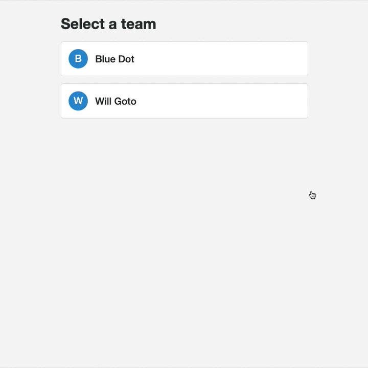

# Curie

This is a multi-step exercise intended to evaluate and emulate, as best as we can, your abilities in the work environment as a Front-End Engineer. In particular, we'll be evaluating the following criteria:

**Attention to Details**

- Covering edge-cases
- Completeness of work
- Cross-browser compatibility
- Accessibility

**Technical Skills**

- Understanding of HTML & CSS
- Understanding of JavaScript & React
- Ability to write clean and readable code
- Ability to abstract repeatable code
- Communication skills

## Setup

First, we'd like you to setup a repository in [GitHub](https://github.com) for this exercise. If you do not have a GitHub account, please create one. The service is free and easy to use. If you do not have any experience using Git, please contact [Will Goto](mailto:will@humbledot.com).

1. Create a new repository, name it `curie-[first name]-[last name]`. Do not include `[` or `]` in the name.
2. Keep the repository public.
3. Keep `Initialize this repository with a README` unchecked.
4. On your computer's terminal `cd` into this directory (named `curie`).
5. Follow the instructions in GitHub to upload this directory to the newly created repository. It should look something like the following:

```
git init
git add README.md
git commit -m "first commit"
git remote add origin git@github.com:wgoto/curie-will-goto.git
git push -u origin master
```

6. In the GitHub repository, go to `Settings`, then `Collaborators`, and add `wgoto`.

After this is done, you should be all set to track and commit your changes as you progress through the exercise. At any point in the exercise, feel free to contact me via email at [will@humbledot.com](mailto:will@humbledot.com) if you have questions or need clarification.

## Directory Layout

In this project you'll find an `index.html` file. This is where you'll write all of your JavaScript to get the task done. This HTML file fetches React and Babel so that you can write in JSX and ES6.

There's file named `css/index.css` where  you'll write all of your CSS associated with the JSX you'll write in `index.html`. Everything should already be setup for you to start coding. Ignore everything else in this directory.

## Exercise - Part 1

If you open `index.html`, you'll find there's a button with the words `Blue Dot`. Clicking on the button should show a dropdown such that the user can select a team. Currently it is not working. The first goal is to make the dropdown work. Here's a spec of the behaviors:

1. Clicking the button once should open the dropdown menu.
2. Clicking the button a second time should close the dropdown menu.
3. Clicking a team in the dropdown menu should show the new team as the button and close the dropdown menu.
4. Clicking outside of the dropdown menu should close the dropdown menu.
5. The dropdown should be accessible for those who are unable to use a mouse.

## Exercise - Part 2

Now we want to add a second dropdown that shows the team members of the selected team. Please see the behavior in the following gif:



Specs:

1. When you select a team, only the team members that belong to that team should show in the second dropdown. Team members belong to a team if they have the team `id` included in their `teams` array.
2. Selecting a new team from the top dropdown should always reset the bottom dropdown (i.e. you cannot have a team member selected who is not part of the selected team).
3. Clicking on the top button while the bottom dropdown is open, should close the bottom dropdown and open the top dropdown.

Please commit and push your work as you would in any work environment to easily allow others to review your changes. Ideally, create one pull request with all of your commits. Once you are finished, please send [Will Goto](mailto:will@humbledot.com) an email and include a link to the pull request so that we can review your work!
